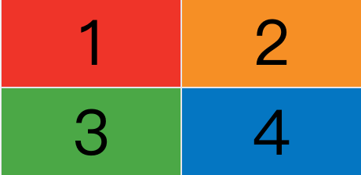

# 一、 概述

网格布局（`Grid`）是最强大的 `CSS` 布局方案。

它将网页划分成一个个网格，可以任意组合不同的网格，做出各种各样的布局。以前，只能通过复杂的 CSS 框架达到的效果，现在浏览器内置了。


Grid 布局与 Flex 布局有一定的相似性，都可以指定容器内部多个项目的位置。但是，它们也存在重大区别。

Flex 布局是轴线布局，只能指定"项目"针对轴线的位置，可以看作是**一维布局**。Grid 布局则是将容器划分成"行"和"列"，产生单元格，然后指定"项目所在"的单元格，可以看作是**二维布局**。Grid 布局远比 Flex 布局强大

# 二、 基本概念

## 2.1 容器和项目

采用网格布局的区域，称为"容器"（container）。容器内部采用网格定位的子元素，称为"项目"（item）。

```html
<div>
  <div><p>1</p></div>
  <div><p>2</p></div>
  <div><p>3</p></div>
</div>
```

最外层 `<div>` 是容器，内层三个 `<div>` 元素是项目。

项目只能是容器的顶层子元素；Grid 布局只对项目生效

## 2.2 行和列

容器里面的水平区域称为"行"（row），垂直区域称为"列"（column）。


## 2.3 单元格

行和列的交叉区域，称为"单元格"（cell）

正常情况下，`n`行和`m`列会产生`n x m`个单元格。比如，3行3列会产生9个单元格。

## 2.4 网格线

划分网格的线，称为"网格线"（grid line）。水平网格线划分出行，垂直网格线划分出列。

正常情况下，`n`行有`n + 1`根水平网格线，`m`列有`m + 1`根垂直网格线，比如三行就有四根水平网格线。


# 三、容器属性

Grid 布局的属性分成两类：

1. 定义在容器上面，称为容器（container）属性
2. 定义在项目上面，称为项目（item）属性

## 3.1 display 属性

`display: grid`指定一个容器采用网格布局。

```css
div {
  display: grid;
}
```


默认情况下，容器元素都是块级元素，但也可以设成行内元素。

```css
div {
  display: inline-grid;
}
```


> 注意，设为网格布局以后，容器子元素（项目）的`float`、`display: inline-block`、`display: table-cell`、`vertical-align`和`column-*`等设置都将失效。

## 3.2 grid-template-columns / grid-template-rows

容器需要划分行和列。

`grid-template-columns` 属性定义每一列的列宽
`grid-template-rows`      属性定义每一行的行高

```css
.container {
  display: grid;
  grid-template-columns: 100px 100px 100px;
  grid-template-rows: 100px 100px 100px;
}
```

指定了一个三行三列的网格，列宽和行高都是`100px`；

除了使用绝对单位 `100px`，还能使用百分比 `40%` 和 `3em`;

### （1）repeat()

`repeat()`函数，可以简化重复的值

```css
.container {
    display: grid;
    grid-template-columns: repeat(5, 20%);
    grid-template-rows: 20% 20% 20% 20% 20%;
}
```

`repeat()`还可以重复某种模式

```css
grid-template-columns: repeat(2, 10px 20px 30px);  /* 10px 20px 30px 10px 20px 30px*/
```

### （2）auto-fill 关键字

如果单元格大小固定，容器大小不确定，可以使用`auto-fill`关键字表示自动填充列 / 行数。

```css
.container {
  display: grid;
  grid-template-columns: repeat(auto-fill, 100px);
}
```

每列宽度`100px`，自动填充，直到容器不能放置更多的列

### （3）fr 关键字

`fr `关键字（fraction 的缩写，意为"片段"）

如果两列的宽度分别为 `1fr` 和 `3fr` ; 那么第一列占据 总宽度的 `1/4`，第二列占据总宽度的 `3/4`

```css
.container {
  display: grid;
  grid-template-columns: 1fr 1fr;
  grid-template-rows: 1fr 1fr;
}
```

​	

当有列被设置为像素 `px` ，百分比 `%`，或 `em`，其他用 `fr` 关键字设置的列就会分摊剩下的空间。

### 简写属性 grid-template

结合了 `grid-template-rows` 和 `grid-template-columns`

```css
#garden {
    display: grid;
    grid-template: 60% 40% / 200px;
}
```

上面代码表示 两行（`60% 40%`）一列（`200px`）。