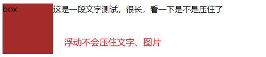
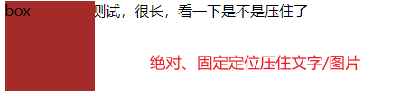

# 浮动

## 清除浮动

清除浮动就是 清除浮动元素造成的影响

清除浮动的策略就是：**闭合浮动**

## 清除浮动的方法

### 1. 额外标签法, W3C 推荐

在浮动元素后添加一个空标签如 <div class="clear"></div>，并在CSS中赋予`.clear{ clear:both; }`属性即可清理浮动。

亦可使用<br class="clear" />或<hr class="clear" />来进行清理

**额外空标签必须是块级元素**

```html
<div class="box">
    <div class="dawa">大娃</div>
    <div class="erwa">二娃</div>
    <div class="clear"></div>
</div> 
```

```css
.dawa {
    float: left;
}
.erwa {
    float: left;
}
.clear {
    clear: both;
}
```

### 2. 给父级添加 overflow 属性

给浮动元素的容器添加 `overflow` 属性，设置为 `hidden`、`auto` 或 `scroll` ; 可以清除浮动。在添加 `overflow` 属性后，浮动元素又回到了容器层，把容器高度撑起，达到了清理浮动的效果

另外在 `IE6` 中还需要触发 `hasLayout` ，例如为父元素设置容器宽高或设置 `zoom:1`

```html
<div class="news">
    
    <p>some text</p>
</div> 
```

```css
.news {
  background-color: gray;
  border: solid 1px black;
  overflow: hidden;
  *zoom: 1;
}

.news img {
  float: left;
}

.news p {
  float: right;
}
```

### 3. 给父级添加 :after 伪元素

```html
<div class="news clearfix">
    
    <p>some text</p>
</div> 
```

```css
.news {
  background-color: gray;
  border: solid 1px black;
}

.news img {
  float: left;
}

.news p {
  float: right;
}
.clearfix:after {
	content: "020";
	display: block;
	height: 0;
	clear: both;
	visibility: hidden;
}
.clearfix {
	/* 触发 hasLayout */
	/* IE6、7 专有 */
	zoom: 1;
}
```

通过CSS伪元素在容器的内部元素最后添加了一个看不见的空格"020"或点"."，并且赋予 `clear`属性来清除浮动。

### 4. 给父级添加双伪元素 :star:

```css
.clearfix:before,
.clearfix:after {
    content: "";
    display: table;
}
.clearfix:after {
    clear: both;
}
.clearfix {
    *zoom: 1;
}
```

# 定位

为什么需要定位 ？

> 某个元素可以在盒子内自由移动，覆盖在其他盒子上面
>
> 滚动窗口时，盒子固定在屏幕某个位置

定位可以理解为给盒子设定一个位置。

**定位 = 定位模式 + 边偏移**

## 1. 定位模式

元素的定位方式 `position`

| 值         | 语义                                                         |
| ---------- | ------------------------------------------------------------ |
| `static`   | **静态**定位<br />(默认，代表无定位)                         |
| `relative` | **相对**定位<br />(不脱离标准流，主要作用给绝对定位当爹)     |
| `absolute` | **绝对**定位<br />(脱标，以`定位的祖先元素`或`文档`为基准进行偏移`) |
| `fixed`    | **固定**定位<br />(脱标)                                     |

### 子绝父相

父亲用`相对`定位
儿子用 `绝对`定位

> 父级占有位置可以保持标准流的结构

## 2. 边偏移

上下左右，偏移量，定位元素对于父元素对应边线的距离。
`top、bottom、left、right`

**定位的特点：1. 是否脱离标准流  2. 以谁为基准移动位置 **

## 3. 定位的层叠顺序 z-index

`z-index: auto/0/正负整数`

- 定位盒子才会有 `z-index` 属性

## 4.绝对定位的盒子 居中算法

设置 `position: absolute` 会使得 盒子水平居中属性 `margin: 0 auto` 的 auto 不生效。

可以通过设置 `left: 50%; margin-left: -1/2 width` 

垂直居中：`top: 50%; margin-top: -1/2 height`

## 5. 定位特殊性

脱标的盒子不会出发外边距塌陷

浮动元素、绝对定位 / 固定定位元素脱标

# 浮动和定位压住标准流的区别

浮动元素会压住它下面标准流盒子，但不会压住它下面标准流盒子的文字、图片

绝对定位 、固定定位会都压住





> 浮动最初是用来做文字环绕效果的

# 元素的显示与隐藏

## 1. display 属性

`display: none` 隐藏元素后，会脱标（不占有原来位置）

## 2. visibility 属性

`visibility: hidden` 隐藏元素，不脱标

## 3. overflow 属性控制溢出内容

`overflow: hidden` 隐藏溢出内容，文字内容不影响排版。若有定位，则慎用

# 精灵图与字体图标

## 1. 精灵图

**用来有效减少服务器接收和发送请求的次数，提高页面加载速度**

CSS 精灵技术（CSS Sprites）

原理：将页面中的一些小背景图像整合到一张大图中，这样只需要一次请求就可以

如何使用：利用 `background-position，移动x、y位置让要显示的内容展示出来` 

缺点：图片文件大、图片放大缩小会失真、**不易更换**

## 2. 字体图标 iconfont

**显示网页中通用的、常用的一些小图标**

字体图标展示的是图标、本质属于字体

优点：

- 轻量级：减少服务器请求，字体加载后就展示出来了
- 灵活性：本质是文字，可以随意改变颜色、产生阴影、透明效果等..
- 兼容性：几乎所有浏览器都可用

结构和样式简单的小图标，使用字体图标

结构和样式复杂一点的小图片，用精灵图

# 用户界面样式

界面样式是指：用户的一些操作样式

## 1. 鼠标样式 cursor

`cursor: pointer`

| 属性值      | 描述      |
| ----------- | --------- |
| default     | 小白 默认 |
| pointer     | 小手      |
| move        | 移动      |
| text        | 文本      |
| not-allowed | 禁止      |


## 2. 表格轮廓 outline

给表单添加 `outline: 0;` 或 `outline: none;` 样式可以去掉默认的蓝色边框。

`input { outline: none }`

## 3. 防止表单域拖拽

防止文本域拖拽 `resize` 

`textarea { resize: none}` 

# vertical-align 属性应用

## 1. 行内块元素垂直居中

`vertical-align` 属性常用于设置图片或表单（行内块元素）和文字垂直对齐。

`vertical-align: middle` 可以让图片和文字垂直居中

## 2. 解决图片底部默认空白缝隙

bug：图片底侧会有一个空白缝隙，原因是行内元素会和文字的基线对齐。

主要解决方法有两种：

1. 给图片添加 `vertical-align: middle | top | bottom` 等 :star: 。
2. 把图片转化为块级元素 `display: block`

# 溢出文字省略号显示

## 1. 单行文本溢出

需要满足三个条件

```css
/* 1. 强制一行内显示文本 */
white-space: nowrap; (默认 normal 自动换行)
/* 2. 超出的部分隐藏 */
overflow: hidden;
/* 3. 文字用省略号替代超出的部分 */
text-over-flow: ellipsis;
```

## 2. 多行文本溢出

