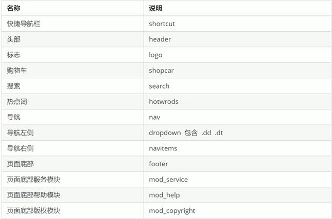

`HTML5` 新特性需要考虑兼容性问题，基本上 `IE9+` 以上支持。

# 1. 语义化标签

以前布局大多是用 `div` 做，对于搜索引擎没有语义（含义）。

```html
<div class="header"></div>
<div class="nav"></div>
<div class="content"></div>
<div class="footer"></div>
```

语义化标签：

- `<header>`
- `<nav>`
- `<article>` ：文章内容
- `<section>` ：文档区域
- `<aside>` ：侧边栏
- `<footer>`

这种语义化标准是针对 **搜索引擎** 的，在 `IE9` 中需要手动转为 **块级元素**

# 2. 多媒体标签

主要：

- 音频 `<audio>`
- 视频 `<video>`

**直接在页面中嵌入音频和视频**，不需要 `flash` 和浏览器插件了。

## 1. `<video>`

`HTML5` 原生支持的[视频格式](https://developer.mozilla.org/en-US/docs/Web/Media/Formats/Containers)文件有限（浏览器主要 mp4, Ogg, WebM 三种视频格式），所有浏览器支持 mp4

```html
<video src="./xx.mp4" controls></video>
```

`<source>` 可以为 `<picture>, <video>, <audio>` 提供多个源，提高浏览器兼容性

```html
<video src="./xx.mp4" controls>
  <source src="myVideo.mp4" type="video/mp4">
  <source src="myVideo.webm" type="video/webm">
  <p>Your browser doesn't support HTML5 video. Here is
     a <a href="myVideo.mp4">link to the video</a> instead.</p>
</video>
```

标签属性查询：https://www.runoob.com/tags/tag-video.html

`autoplay` 谷歌浏览器不会自动播放，需要加 `muted="muted"` 静音解决。

## 2. `<audio>`

`HTML5` 原生支持[音频格式](https://developer.mozilla.org/en-US/docs/Web/Media/Formats/Audio_codecs)文件有限（MP3，Wav，Ogg），所有浏览器都支持 mp3

```html
<audio src="./xx.mp3" controls></audio>
```

```html
<audio controls>
  <source src="horse.ogg" type="audio/ogg">
  <source src="horse.mp3" type="audio/mpeg">
您的浏览器不支持 audio 元素。
</audio>
```

标签属性查询：https://www.runoob.com/tags/tag-audio.html

谷歌浏览器禁止了自动播放

# 3. 表单标签

`HTML5` 新增了 `input` 的类型

`type="email" 邮箱, type="number"` 数字, `type="search"` 搜索框

date 日期，time 时间， month/week 月/周，tel 电话，url 地址，color 拾色器

其他可查：https://www.runoob.com/tags/att-input-type.html

这些表单标签放在 `form` 中时自带验证。

## 新增表单属性

`input` 的属性：https://www.runoob.com/tags/tag-input.html

例如 `required` 必填 ，`placeholder` 提示文本

css 技巧例如修改提示文本颜色

```css
input::placeholder{ color: pink;}
```

`autofocus`, `autocomplete` 记录以前输入得文字信息

`multiple` 可以多选文件

# `TDK` 三大标签  `SEO` 优化

`SEO`：`Search Engine Optimization` ，**搜索引擎优化**，一种利用搜索引擎的规则提高网站在有关搜索引擎内自然排名的方式。

`SEO` 的目的是 **网站的深度优化** 

一般有专门 `SEO` 人员来写内容，**前端的工作就是把标签准备好**。

三个标签可以用来 `SEO` 优化：

```html
<!-- 以京东为例  -->
<head>
    <title>京东(JD.COM)-正品低价、品质保障、配送及时、轻松购物！</title>
    <meta name="description" content="京东JD.COM-专业的综合网上购物商城，为您提供正品低价的购物选择、优质便捷的服务体验。商品来自全球数十万品牌商家，囊括家电、手机、电脑、服装、居家、母婴、美妆、个护、食品、生鲜等丰富品类，满足各种购物需求。">
    <meta name="Keywords" content="网上购物,网上商城,家电,手机,电脑,服装,居家,母婴,美妆,个护,食品,生鲜,京东">
</head>
```

## 三大标签

### 1. `title` 标题

**网站名（产品名）- 网站的介绍**（尽量不超过 30 个汉字）

### 2. `description` 描述

**说明网站是做什么的**

### 3. `keywords` 关键字

**页面关键词，搜索引擎关注**

6~8个关键词，用 **关键词1，关键词2** 的形式

## `LOGO SEO` 优化

1. logo 盒子里放一个 `h1` 标签，目的是提权，提醒搜索引擎很重要
2. `h1` 下面再放入一个 **链接** ，点击返回首页，logo 作为链接的背景图。
3. 为了让搜索引擎收录，链接里面放入 **文字（网站名称）**，但要隐藏。
   1. `text-indent` 移到盒子外边（`text-indent: -9999px`)，然后 `overflow: hiddent`，淘宝做法。
   2. `font-size: 0;`，京东做法
4. 给链接添加 `title` 属性，鼠标放在 logo 上有提示文字。


# 常用模块类名命名



