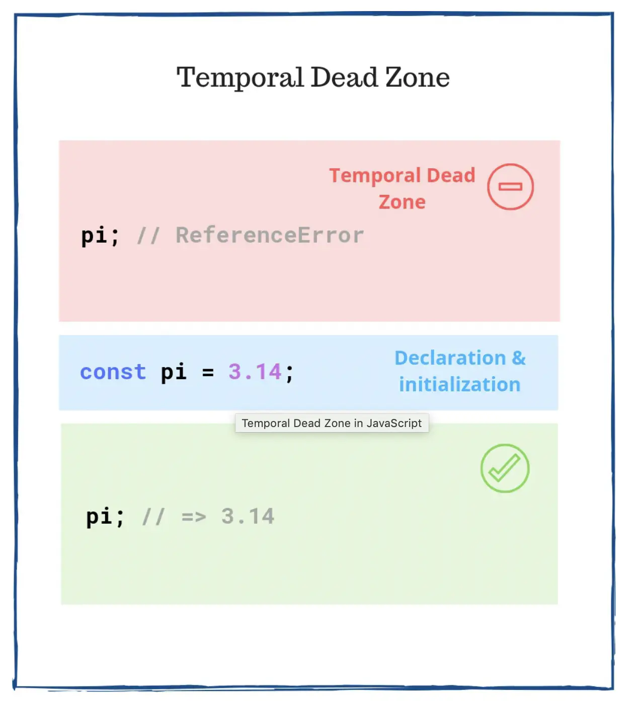
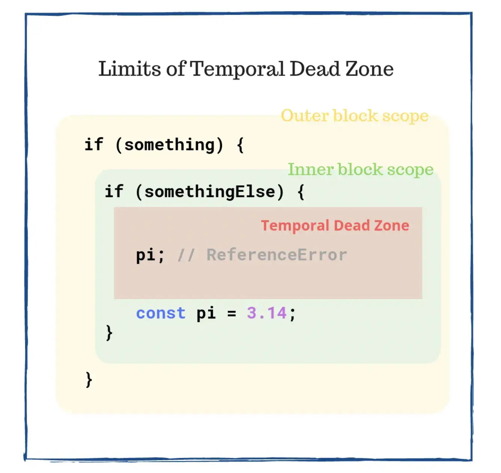

**Don't Use JavaScript Variables Without Knowing Temporal Dead Zone**

看一个简单问题。 以下哪个代码片段将产生错误？

第一个，使用class定义了一个类然后创建类一个实例：

```javascript
new Car('red'); // Does it work?

class Car {
  constructor(color) {
    this.color = color;
  }
}
```

第二个，先引用后定义一个函数：

```javascript
greet('World'); // Does it work?

function greet(who) {
  return `Hello, ${who}!`;
}
```

正确答案是：第一段用 class 定义的代码，会产生一个 `ReferenceError` 错误，第二个运行正常。

`TDZ` 作用于 `let`、`const`和`class`语句

# 1. 什么是暂时性死区

我们从一个简单的const声明开始。先声明并初始化变量并且访问他，完全ok。

```javascript
const white = '#FFFFFF';

white; // => '#FFFFFF'
```

下面我们尝试定义前访问变量`white`:

```javascript
white; // throws `ReferenceError`

const white = '#FFFFFF';

white;
```

直到 `const white = '#FFFFFF'`语句，变量`white`一直在TDZ中。
如果访问了TDZ中的`white`， JavaScript会抛错，`ReferenceError: Cannot access 'white' before initialization.`



> TDZ语义强制要求访问前必须先定义，强制要求：声名必须先于使用。

# 2. 受TDZ影响的语法

## 2.1 const 变量

如你所见，`const`变量在声明和初始化前在TDZ中：

```javascript
// Does not work!
pi; // throws `ReferenceError`

const pi = 3.14;
```

可以在const声明变量后使用它：

```javascript
const pi = 3.14;

// Works!
pi; // => 3.14
```

## 2.2 let 变量

let声名变量的语法也会收到TDZ的影响：

```javascript
// Does not work!
count; // throws `ReferenceError`

let count;

count = 10;
```

同理在let声明后使用：

```javascript
let count;

// Works!
count; // => undefined

count = 10;

// Works!
count; // => 10
```

## 2.3 class 声明

直到`class`定义前不能正常使用：

```javascript
// Does not work!
const myNissan = new Car('red'); // throws `ReferenceError`

class Car {
  constructor(color) {
    this.color = color;
  }
}
```

想要正常使用，必须保证先使用class定义：

```javascript
class Car {
  constructor(color) {
    this.color = color;
  }
}

// Works!
const myNissan = new Car('red');
myNissan.color; // => 'red'
```

## 2.4 constructor() 中的super()

如果继承了父类，在调用构造器中的super()前
If you extend a parent class, before calling super() inside the constructor, this 绑定为于TDZ中:

```javascript
class MuscleCar extends Car {
  constructor(color, power) {
    this.power = power;
    super(color);
  }
}

// Does not work!
const myCar = new MuscleCar('blue', '300HP'); // `ReferenceError`
```

`constructor()`中, 直到`super()`调用后 `this`才能正常使用。

TDZ建议调用父类构造器先初始化实例。在这之后，实例才会准备好了，你可以在子构造器中进行调整。

```javascript
class MuscleCar extends Car {
  constructor(color, power) {
    super(color);
    this.power = power;
  }
}

// Works!
const myCar = new MuscleCar('blue', '300HP');
myCar.power; // => '300HP'
```

## 2.5 函数默认参数

默认参数作用于当前作用域中，与全局作用域是分开的。默认参数同样受制于TDZ：

```javascript
const a = 2;
function square(a = a) {
  return a * a;
}
// Does not work!
square(); // throws `ReferenceError`
```

在`a`声明前，参数`a`会被表达式`a = a`右边的a所使用， 这样会产生一个`a`的引用错误。
保证参数在使用前声明和初始化，我们用一个特殊的变量`init`来初始化。

```javascript
const init = 2;
function square(a = init) {
  return a * a;
}
// Works!
square(); // => 4
```

# 3. var, function, import 语法

`var`和`function`不会收到TDZ影响，他会被所在的作用域提升。
如果在声明前访问`var`定义的变量，通常会得到`undefined`。

```javascript
// Works, but don't do this!
value; // => undefined

var value;
```

function可以正常使用无论他在哪里声明。

```javascript
// Works!
greet('World'); // => 'Hello, World!'

function greet(who) {
  return `Hello, ${who}!`;
}

// Works!
greet('Earth'); // => 'Hello, Earth!'
```

`import`的模块也是会被提升的：

```js
// Works!
myFunction();

import { myFunction } from './myModule';
```

import会被提升，所以最佳实践是在文件头部import依赖模块。

# 4. typeof 在TDZ中的行为

`typeof`运算符可以用来确认变量是否在当前作用域被定义。

比如，notDefined变量没有定义，在这个变量上使用`typeof`不会抛错：

```javascript
typeof notDefined; // => 'undefined'
```

由于未定义的关系，所以`typeof notDefined`的运算结果是`undefined`。
但是在位于TDZ中的变量使用`typeof`操作符会产生不同的行为。下面的例子会抛错：

```js
typeof variable; // throws `ReferenceError`

let variable;
```

# 5. TDZ在当前作用域中的行为

TDZ所在作用域内的相关声明都会收其影响。



```js
function doSomething(someVal) {
  // Function scope
  typeof variable; // => undefined
  if (someVal) {
    // Inner block scope
    typeof variable; // throws `ReferenceError`
    let variable;
  }
}
doSomething(true);
```

这里有2个作用域:

1. function 作用域。
2. `let`定义的内部块级作用域。

在函数作用域，`typeof variable` 简单求值运算得到 `undefined`。 这里 `let variable` 不受TDZ影响。

内部作用域中的 `typeof variable` 语句，因为在声明前使用变量,会抛出一个错误 `ReferenceError: Cannot access 'variable' before initialization`。TDZ仅影响内部所在的作用域。

# 6. 总结

TDZ是一个重要的概念，会影响`const`、`let`和`class`语句的可用性。不容许声明前使用变量。

相反的可以在声明前使用`var`定义的变量，这是一个旧的机制。我们应该避免它。

在我看来，好的编码习惯来达到语言规范TDZ是一个好事。